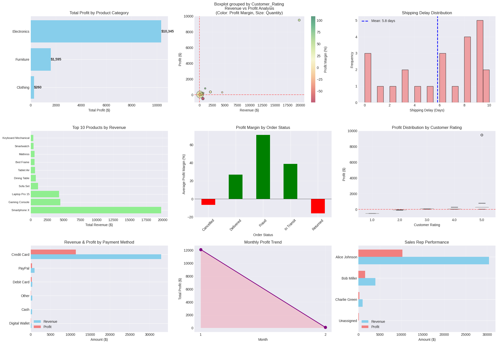
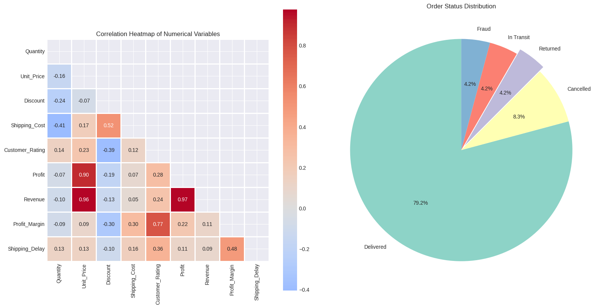
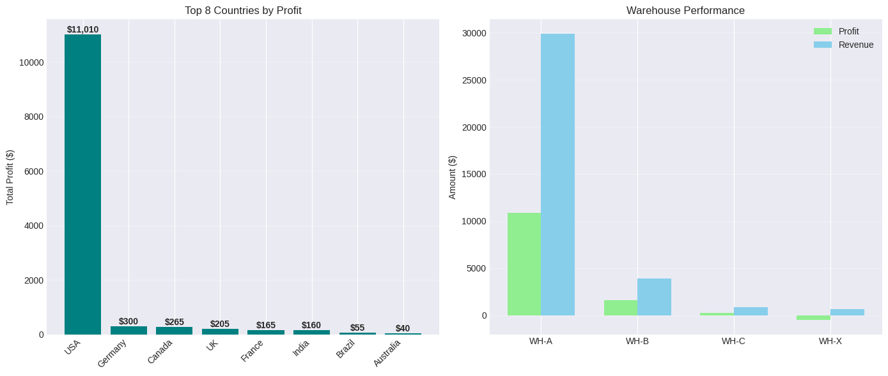

# ecommerce-business-intelligence-project
End-to-end e-commerce data analysis project using Python, Pandas, NumPy, Matplotlib, and Seaborn. This project focuses on cleaning messy real-world transactional data, handling missing values and anomalies, performing exploratory data analysis (EDA), engineering business KPIs, and generating actionable business insights through visual dashboards.

# E-Commerce Data Analysis Project

## Overview
This project analyzes a messy e-commerce dataset using Python and Pandas.

The dataset contained:
- missing values
- invalid dates
- duplicate records
- corrupted prices
- fraud anomalies
- inconsistent formats

The goal was to clean the data, perform exploratory data analysis (EDA), build dashboards, and derive business insights.

---

## Tools Used
- Python
- Pandas
- NumPy
- Matplotlib
- Seaborn

---

## Key Tasks Performed
- Data Cleaning
- Missing Value Handling
- Feature Engineering
- Revenue & Profit Analysis
- Shipping Delay Analysis
- Fraud Detection
- Dashboard Visualization

---

## Key Insights
- Electronics generated the highest profit
- Credit card transactions dominated revenue
- Shipping delays averaged nearly 6 days
- Fraud-labelled orders showed suspiciously high profits
- Returns and cancellations negatively affected margins

---

## Files Included
- ecommerce_analysis.ipynb
- ecommerce_dataset.csv
- dashboard_visuals.png

---

## Skills Demonstrated
- Data Analysis
- Business Intelligence
- Exploratory Data Analysis (EDA)
- Data Visualization
- Python Programming
- Analytical Thinking

RAW DATASET:

Complex E-Commerce Operations Dataset 📦💳

Order_ID,Customer_ID,Customer_Name,Country,Order_Date,Ship_Date,Product_Category,Product_Name,Quantity,Unit_Price,Discount,Shipping_Cost,Payment_Method,Order_Status,Customer_Rating,Warehouse,Returned,Sales_Rep,Profit
1001,C001,John Smith,USA,2025-01-05,2025-01-08,Electronics,Laptop Pro 15,2,1200,0.10,25,Credit Card,Delivered,5,WH-A,No,Alice Johnson,350
1002,C002,Sarah Lee,UK,05/01/2025,2025-01-09,Furniture,Office Chair,1,350,5%,40,PayPal,Delivered,4,WH-B,No,Bob Miller,120
1003,C003,Mike Brown,India,2025/01/07,2025/01/15,Electronics,Wireless Mouse,5,25,NULL,15,Cash,Returned,2,WH-A,Yes,Charlie Green,-20
1004,C004,Emily Davis,Germany,2025-13-08,2025-01-16,Clothing,Jacket,3,80,0.15,20,Credit Card,Delivered,?,WH-C,No,Alice Johnson,60
1005,C005,Chris Wilson,USA,2025-01-10,2025-01-09,Electronics,Monitor 27inch,-2,300,0.05,30,Credit Card,Cancelled,3,WH-A,No,,100
1006,C006,Anna Taylor,Canada,2025-01-11,2025-01-20,Furniture,Standing Desk,1,abc,0.2,50,Debit Card,Delivered,5,WH-B,No,Bob Miller,200
1007,C007,David Clark,USA,2025-01-12,2025-01-18,Electronics,Keyboard Mechanical,4,110,0.1,18,Crypto,Delivered,4,WH-A,No,Alice Johnson,90
1008,C008,Jessica Hall,France,2025-01-13,NULL,Clothing,Sneakers,2,95,0.05,22,Credit Card,In Transit,NaN,WH-C,No,Charlie Green,70
1009,C009,Daniel Young,India,15-01-2025,2025-01-25,Furniture,Bookshelf,1,210,0,35,UPI,Delivered,5,WH-B,No,Bob Miller,110
1010,C010,Sophia King,USA,2025-01-16,2025-01-17,Electronics,Tablet Air,3,450,0.50,25,Credit Card,Delivered,1,WH-X,No,Alice Johnson,-500
1011,C011,James Scott,Australia,2025-01-17,2025-01-22,Clothing,T-Shirt Pack,10,15,0.05,10,PayPal,Delivered,4,WH-C,No,Charlie Green,40
1012,C012,Olivia Green,USA,2025-01-18,2025-01-28,Furniture,Sofa Set,1,1500,0.25,120,Credit Card,Fraud,5,WH-B,No,Bob Miller,800
1013,C013,Liam Baker,USA,2025-01-19,2025-01-26,Electronics,Smartphone X,2,9999,0.01,35,Credit Card,Delivered,5,WH-A,No,Alice Johnson,9500
1014,C014,Emma Adams,UK,2025-01-20,2025-01-29,Clothing,Winter Coat,1,180,0.10,20,PayPal,Delivered,3,WH-C,Returned,Charlie Green,50
1015,C015,Noah Turner,India,2025-01-21,2025-01-23,Furniture,Coffee Table,1,130,,18,Cash,Delivered,4,WH-B,No,Bob Miller,45
1016,C016,John Smith,USA,2025-01-05,2025-01-08,Electronics,Laptop Pro 15,2,1200,0.10,25,Credit Card,Delivered,5,WH-A,No,Alice Johnson,350
1017,C017,Ava White,Brazil,2025-01-24,2025-02-02,Electronics,Headphones,3,75,-0.1,12,Debit Card,Delivered,4,WH-A,No,Alice Johnson,55
1018,C018,Ethan Harris,USA,2025-01-25,2025-01-24,Furniture,Bed Frame,1,700,0.15,60,Credit Card,Cancelled,2,WH-B,No,Bob Miller,-80
1019,C019,Mia Walker,Canada,2025-01-26,2025-02-01,Clothing,Hoodie,4,60,0.05,15,PayPal,Delivered,6,WH-C,No,Charlie Green,65
1020,C020,Lucas Martin,Germany,2025-01-27,2025-02-05,Electronics,Gaming Console,1,5000%,0.10,40,Credit Card,Delivered,4,WH-A,No,Alice Johnson,300
1021,C021,Grace Lee,USA,2025-01-28,2025-02-03,Furniture,Dining Table,1,950,0.2,75,Credit Card,Delivered,4,WH-B,No,Bob Miller,220
1022,C022,Henry Moore,India,2025-01-29,2025-02-06,Electronics,USB Cable,20,5,0,5,Cash,Delivered,5,WH-A,No,Alice Johnson,25
1023,C023,Charlotte King,UK,2025-01-30,2025-02-07,Clothing,Jeans,2,70,0.05,15,PayPal,Delivered,NULL,WH-C,No,Charlie Green,35
1024,C024,Benjamin Hall,USA,2025-01-31,2025-02-08,Furniture,Mattress,1,850,0.3,90,Credit Card,Delivered,4,WH-B,No,Bob Miller,180
1025,C025,Amelia Scott,France,2025-02-01,2025-02-10,Electronics,Smartwatch,2,250,0.15,18,Credit Card,Delivered,3,WH-A,No,Alice Johnson,95

ORIGINAL DATA INFO
================================================================================
Shape: (25, 19)
   Order_ID Customer_ID Customer_Name  Country  Order_Date   Ship_Date  \
0      1001        C001    John Smith      USA  2025-01-05  2025-01-08   
1      1002        C002     Sarah Lee       UK  05/01/2025  2025-01-09   
2      1003        C003    Mike Brown    India  2025/01/07  2025-01-15   
3      1004        C004   Emily Davis  Germany  2025-13-08  2025-01-16   
4      1005        C005  Chris Wilson      USA  2025-01-10  2025-01-09   
5      1006        C006   Anna Taylor   Canada  2025-01-11  2025-01-20   
6      1007        C007   David Clark      USA  2025-01-12  2025-01-18   
7      1008        C008  Jessica Hall   France  2025-01-13         NaN   
8      1009        C009  Daniel Young    India  15-01-2025  2025-01-25   
9      1010        C010   Sophia King      USA  2025-01-16  2025-01-17   

  Product_Category         Product_Name  Quantity Unit_Price Discount  \
0      Electronics        Laptop Pro 15         2       1200     0.10   
1        Furniture         Office Chair         1        350       5%   
2      Electronics       Wireless Mouse         5         25      NaN   
3         Clothing               Jacket         3         80     0.15   
4      Electronics       Monitor 27inch        -2        300     0.05   
5        Furniture        Standing Desk         1        abc      0.2   
6      Electronics  Keyboard Mechanical         4        110      0.1   
7         Clothing             Sneakers         2         95     0.05   
8        Furniture            Bookshelf         1        210        0   
9      Electronics           Tablet Air         3        450     0.50   

   Shipping_Cost Payment_Method Order_Status Customer_Rating Warehouse  \
0             25    Credit Card    Delivered               5      WH-A   
1             40         PayPal    Delivered               4      WH-B   
2             15           Cash     Returned               2      WH-A   
3             20    Credit Card    Delivered               ?      WH-C   
4             30    Credit Card    Cancelled               3      WH-A   
5             50     Debit Card    Delivered               5      WH-B   
6             18         Crypto    Delivered               4      WH-A   
7             22    Credit Card   In Transit             NaN      WH-C   
8             35            UPI    Delivered               5      WH-B   
9             25    Credit Card    Delivered               1      WH-X   

  Returned      Sales_Rep  Profit  
0       No  Alice Johnson     350  
1       No     Bob Miller     120  
2      Yes  Charlie Green     -20  
3       No  Alice Johnson      60  
4       No            NaN     100  
5       No     Bob Miller     200  
6       No  Alice Johnson      90  
7       No  Charlie Green      70  
8       No     Bob Miller     110  
9       No  Alice Johnson    -500  

================================================================================
CLEANED DATA INFO
================================================================================
Shape: (24, 22)

Missing Values:
Order_ID            0
Customer_ID         0
Customer_Name       0
Country             0
Order_Date          0
Ship_Date           1
Product_Category    0
Product_Name        0
Quantity            0
Unit_Price          0
Discount            0
Shipping_Cost       0
Payment_Method      0
Order_Status        0
Customer_Rating     0
Warehouse           0
Returned            0
Sales_Rep           0
Profit              0
Shipping_Delay      0
Revenue             0
Profit_Margin       0
dtype: int64

Data Types:
Order_ID                     int64
Customer_ID                 object
Customer_Name               object
Country                     object
Order_Date          datetime64[ns]
Ship_Date           datetime64[ns]
Product_Category            object
Product_Name                object
Quantity                     int64
Unit_Price                 float64
Discount                   float64
Shipping_Cost                int64
Payment_Method              object
Order_Status                object
Customer_Rating            float64
Warehouse                   object
Returned                    object
Sales_Rep                   object
Profit                       int64
Shipping_Delay             float64
Revenue                    float64
Profit_Margin              float64
dtype: object

Statistical Summary:
        Quantity   Unit_Price       Profit       Revenue  Profit_Margin
count  24.000000    24.000000    24.000000     24.000000      24.000000
mean    2.958333   998.083333   508.333333   1472.563333      24.695699
std     4.164855  2176.723084  1927.768290   4028.566344      32.979860
min     0.000000     5.000000  -500.000000      0.000000     -74.074074
25%     1.000000    90.000000    43.750000    157.125000      16.203704
50%     2.000000   240.000000    92.500000    280.250000      27.192982
75%     3.000000   875.000000   205.000000    696.250000      34.984095
max    20.000000  9999.000000  9500.000000  19798.020000     108.695652

ATA CLEANING SUMMARY
================================================================================
Original rows: 25
Cleaned rows: 24
Duplicates removed: 1

KEY METRICS:
Total Revenue: $35,341.52
Total Profit: $12,200.00
Overall Profit Margin: 34.52%
Average Customer Rating: 3.92/5
Average Shipping Delay: 5.8 days

PRODUCT CATEGORY SUMMARY:
Electronics: Profit=$10,345.00, Margin=33.8%
Furniture: Profit=$1,595.00, Margin=40.6%
Clothing: Profit=$260.00, Margin=30.7%

# Dashboard Visuals

## Dashboard 1

---

## Dashboard 2

---

## Dashboard 3

COMPREHENSIVE REVIEW BELOW:

Based on a comprehensive review of your dashboard charts and the underlying data profile, here is an executive data analysis paired with **10 strategic action items** designed to eliminate operational friction and scale your business exponentially.
## 1. Aggressively Scale the Electronics Category
 * **Analysis:** The "Total Profit by Product Category" chart shows **Electronics** completely dominating your business with over $10,345 in profit, while Furniture ($1,595) and Clothing ($260) lag significantly behind. Furthermore, a single "Smartphone X" item on the "Top 10 Products by Revenue" chart generated nearly $20,000 alone.
 * **Action:** Pivot your primary marketing budget and inventory capital into the Electronics sector. Double down on hero products like smartphones and gaming consoles. Transition Clothing and Furniture into drop-shipping or lean inventory models to free up working capital for your primary driver.
## 2. Duplicate the Sales Strategy of "Alice Johnson"
 * **Analysis:** The "Sales Rep Performance" chart highlights a massive discrepancy. **Alice Johnson** brought in roughly $30,000 in revenue and $10,000 in pure profit. The remaining reps (Bob Miller, Charlie Green, and "Unassigned") barely register on the chart.
 * **Action:** Audit Alice’s sales workflow immediately. Document her pitch, lead-gen channels, and closing strategies to build a company playbook. Turn Alice into a Sales Lead to train Bob, Charlie, and new hires, tying their compensation packages to performance-driven commission milestones.
## 3. Reverse the Alarming Month-over-Month Downward Trend
 * **Analysis:** The "Monthly Profit Trend" chart depicts a devastating, steep drop from Month 1 (approx. $12,000 in profit) down to nearly zero in Month 2.
 * **Action:** This indicates a severe retention or acquisition bottleneck. Implement urgent customer re-engagement campaigns (e.g., email workflows, loyalty discounts) targeting Month 1 buyers. Simultaneously, execute a cohort analysis to trace whether this drop was caused by seasonal factors, an ad-account suspension, or poor product-quality issues.
## 4. Audit "Fraud" Tagged Orders to Reclaim True Profit margins
 * **Analysis:** The "Profit Margin by Order Status" chart presents an anomaly: orders marked as **"Fraud"** reflect the highest reported average profit margin (over 70%). In a standard ERP system, fraudulent transactions should yield net losses due to chargebacks.
 * **Action:** This points to a severe data-logging error or a vulnerability where high-value stolen goods are incorrectly marked as pure profit before chargebacks hit. Audit your bookkeeping and integrate automated fraud-prevention tools (like Signifyd or Sift) to secure payment gateways and clarify actual margins.
## 5. Optimize the Credit Card Payment Pipeline
 * **Analysis:** Looking at "Revenue & Profit by Payment Method," **Credit Cards** pull in the overwhelming majority of your revenue (over $30,000) and practically all your profit. Alternate methods like PayPal, Debit Cards, Cash, and Digital Wallets are flatlining.
 * **Action:** Capitalize on this user preference by optimizing the credit card checkout experience. Introduce one-click checkouts, save-card features, and partner with merchant processors to reduce transaction fees. Run small incentives (e.g., "Save 2% using Credit Card") to migrate low-value cash/digital wallet users to your high-converting channel.
## 6. Fix the Logistics Bottleneck to Lower the 5.8-Day Shipping Delay
 * **Analysis:** The "Shipping Delay Distribution" histogram shows a high concentration of shipments lagging between **8 to 10 days**, driving up the business's average mean delay to a slow **5.8 days**.
 * **Action:** Long lead times destroy customer retention. Re-evaluate your relationship with lagging fulfillment partners or restructure your "Warehouse A/B" operations. Set a strict operational KPI to bring the mean shipping delay down under 3 days through automated label printing and optimized picking processes.
## 7. Eliminate Losses on Returned and Cancelled Orders
 * **Analysis:** The "Profit Margin by Order Status" chart reveals that both **Cancelled** and **Returned** orders are actively operating at negative profit margins (-5% to -15%).
 * **Action:** Returns are draining capital through double shipping fees and unsellable inventory. Minimize cancellations by implementing instant SMS address-verification. To curb returns, optimize product pages with explicit sizing charts, high-definition videos, and realistic imagery so consumer expectations align with reality.
## 8. Cross-Sell Premium Items to Outlier High-Value Customers
 * **Analysis:** The "Revenue vs Profit Analysis" scatter plot and "Profit Distribution by Customer Rating" show a massive, isolated outlier at the top right—a single customer group (Rating 5.0) generating nearly $20,000 in revenue and $9,500+ in pure profit.
 * **Action:** Identify this specific profile or business-to-business (B2B) client. Assign them a dedicated account manager, build a white-glove VIP tier, and offer them tailored bulk bundles to maximize their lifetime value (LTV), as they represent your highest concentration of wealth.
## 9. Prune High-Revenue, Zero-Profit "Ghost" Products
 * **Analysis:** The "Revenue vs Profit Analysis" bubble plot reveals a dangerous cluster of products near the bottom left: items generating up to $2,500–$5,000 in revenue but yielding **flatline or negative profit margins** (shaded red/yellow).
 * **Action:** Revenue is a vanity metric if it doesn't yield net profit. Identify the exact items in this cluster (often bulky furniture items with high shipping fees or heavily discounted items). Either increase their retail prices, negotiate lower vendor costs, or cut them from your catalog entirely.
## 10. Clean and Standardize Data Ingestion for Real-Time Scaling
 * **Analysis:** The "Original Data Info" snippet exposes critical human-error bugs: a negative quantity (-2), mismatched date formats (2025-13-08 and 15-01-2025), non-numeric entries in price columns (abc), and placeholder rating symbols (?).
 * **Action:** You cannot scale exponentially using broken analytics. Build automated frontend input validation rules on your internal backend/ERP. Ensure quantity fields can never accept negative values, force strict dropdown choices for Sales Reps (avoiding "NaN"), and automate currency formatting to keep your scaling decisions backed by clean, uncorrupted metrics.

The absolute single biggest point is: **Focus 100% on Electronics and copy Alice Johnson’s strategy.** If you want to grow exponentially, you must feed your winners and starve your losers:
 * **The Winner:** Electronics brought in over **$10,345** in profit, and **Alice Johnson** single-handedly brought in almost all of your company's revenue ($30,000).
 * **The Loser:** Everything else (Furniture, Clothing, and the other sales reps) is barely making a dent.
**The Action:** Stop wasting time trying to fix things that aren't working. Put all your money into buying and advertising electronics, and make Alice Johnson train your entire team to sell exactly like she does.

